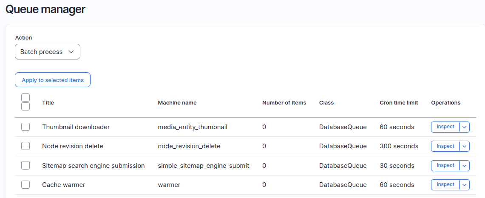

# The Drupal Queue API
<p class="centre">Philip Norton<br>
<!-- Speaker notes will appear here. -->

---

# Philip Norton
- Developer at Code Enigma
- Writer at `#! code` (www.hashbangcode.com)
- NWDUG co-organiser


<!--
- Doing Drupal for about 15 years.
- Programming in general for about 20 now.
- That is a picture of a Lily58 mechanical keyboard.
-->

---

<!-- _footer: "" -->
## Source Code
- Talk is available at:
<small>https://github.com/hashbangcode/drupal-queue-api-talk</small> 
- All code seen can be found at:
<small>https://bit.ly/4gTYaLP</small>
- I have also written about the<br>Queue API on <small>[www.hashbangcode.com](www.hashbangcode.com)</small>


<!-- 
- Scan the QR code for the talk repo. Which has links to all of the resources you need.
-->
---
# The Drupal Queue API

<!--
The Drupal Queue API is a system that allows us to split up large tasks that will be run asynchronously so that we don't overload the web server. It is also the system that powers the Batch API.
In this session we will look at why we need the Drupal Queue API and how it prevents issues. We'll then do a dive into the code surrounding the Queue API and how to run your own queue operations.
There will be a few demos on running the Queue API to perform some simple tasks.
Finally, we'll look at how Drupal uses the Queue API internally and some use cases of the Queue API in contributed modules.
-->
---

## What Is The Queue API?

Allows tasks to be processed in asynchronously in order to prevent timeout errors or memory problems.

---

## The Queue API

- The Queue API in Drupal has no user interface as everything happens behind the scenes.
- The Batch API is built upon the Queue API and uses both the database and memory queues.

---

## The Queue API
- The API is highly extensible. By default we have a database queue and a memory queue interfaces.
- When creating a queue it is common for the database queue to be used. The cron system automatically picks up queue items and processes them.

---

# When To Use A Queue

- Use a queue when you need to process something that can be done asynchronously. For example:
  - Perform an action on multiple items of content.
  - Synchonise data to (or from) an API.

---

# When To Use A Queue

For example, let's say you wanted to delete all taxonomy items on a site.

Instead of doing this in one go you would add all of the taxonomy IDs to a queue and process them one by one.

---

## The Queue API

The API consists of three parts:

- A storage interface for the queue.
- The queue worker that will process a single item in the queue.
- A processing step that picks items out the queue and processes it using the worker.

---

# Create A Queue

---

## Create A Queue

- To create a queue we use the `queue` service, which is a factory that produces queue objects.

```php
/** @var \Drupal\Core\Queue\QueueFactoryInterface $queueFactory */
$queueFactory = \Drupal::service('queue');
```

---

## Create A Queue

- We can use the factory to generate a queue with an arbritary name.

```php
/** @var \Drupal\Core\Queue\QueueInterface $queue */
$queue = $this->queueFactory->get('queue_simple_example');
```

- By default we use the database queue, which stores queue items in the `queue` table.

---

## Create A Queue

- This can be simplified in a single step.

```php
/** @var \Drupal\Core\Queue\QueueInterface $queue */
$queue = \Drupal::queue('queue_simple_example');
```

---

## Create A Queue

- Using the queue interface we can then add items to the queue for later processing.

```php
$item = new \stdClass();
$item->id = 123;
$queue->createItem($item);
```

- After running this code we will now have the data "123" stored in the queue table in a PHP serialised format.

---

## Create A Queue

- Here is the data in the queue table.

```
> select * from queue;
+---------+--------------------------------+------------------------------------+--------+------------+
| item_id | name                           | data                               | expire | created    |
+---------+--------------------------------+------------------------------------+--------+------------+
|    5156 | queue_simple_example           | O:8:"stdClass":1:{s:2:"id";i:123;} |      0 | 1735664606 |
+---------+--------------------------------+------------------------------------+--------+------------+

```

---

## Create A Queue

- You can see the number of items in your queue quite easily.

```php
$queue->numberOfItems()
```

---

# Create A Queue Worker

A queue worker is required to process the tasks in the queue.

---

## Create A Queue Worker

- A queue worker is a plugin that accepts single items in the queue.
- When Drupal is processing the queue it will pass each item to the processor.
- If everything is processed correctly then 

---
<!-- _footer: "" -->
## Create A Queue Worker

- To define a queue worker we create a class in the directory `src/Plugin/QueueWorker` in a custom module. This contains the following annotation.

```php
/**
 * Queue worker for the queue_simple_example.
 *
 * @QueueWorker(
 *   id = "queue_simple_example",
 *   title = @Translation("Queue worker for the simple queue example."),
 *   cron = {"time" = 60}
 * )
 */
class QueueExampleWorker extends QueueWorkerBase
}
```
---
## Create A Queue Worker
- The class must contain a `process()` method, that accepts the data we want to process.

```php
public function processItem($data) {
  // $data->id contains the id we added to the queue. 
}
```
- If we return nothing from the process method then the queue item is deleted from the queue.

---
<!-- _footer: "" -->
## Throwing Exceptions During Processing

We can effect the queue in different ways by throwing different exceptions.
- `\Drupal\Core\Queue\DelayedRequeueException` - For database queues, the item is added back to the queue and held back for an hour.
- `\Drupal\Core\Queue\RequeueException` - The item is added back into the queue and will be picked up later in the processing.

---
## Throwing Exceptions During Processing

- `\Drupal\Core\Queue\SuspendQueueException` - The item is added back into the queue and the queue execution is stopped.
- `\Exception` - The item is added back into the queue for later processing and an error is logged.

---

# Processing A Queue

The eaiest way to process a queue is to run cron.
    
- Via the cron processor form at "/admin/config/system/cron".
- Via the "Run cron" link on the status page.
- Via Drush using the command `drush cron`.

---
## Processing A Queue

- It is possible to process queues outside of cron.
- Use the queue factory to load the queue and the queue worker plugin to process the item.

```php
$queue = \Drupal::service('queue')->get('queue_simple_example');
$worker = \Drupal::service('plugin.manager.queue_worker')->createInstance('queue_simple_example');

$item = $queue->claimItem();
$worker->processItem($item->data);
$queue->deleteItem($item);
```

---

# Examples Of Queue API In Action

Some live demos!

---

## Run A Queue
- A look at the Queue API.

---

## Custom Queue Processing
- Custom queue processing.

---

## Queue Storage Customisation
- Change the database handler for queues.

---

# Some Tips On Queue API Usage

---

<!-- _footer: "" -->

## Top Tips
- Keep an eye on the numbers in your queue.
- Think about the amount of time that it would take to process your queue.
- Don't store too much in your queue items, just enough to provide context.
- There is no interface for queues so be sure to handle errors properly.
- If your users need to process something straight away then use a batch.

---

# Modules That Use Queue

---

<!-- _footer: "" -->
## Queue UI

<small>- View and run queues, also inspect their contents.</small>

<small>https://www.drupal.org/project/queue_ui</small>



---

<!-- _footer: "" -->
## Warmer

- Warms the cache for content entities. Runs this process via a queue.

<small>https://www.drupal.org/project/warmer</small>

---

<!-- _footer: "" -->
## Queue Unique

- Creates a custom queue storage handler to store all items in the queue as unique.

<small>https://www.drupal.org/project/queue_unique</small>

---

## Resources

- Queues on `#! code` <small>https://www.hashbangcode.com/tag/queues-api</small>
- All code seen is code available at <small>https://github.com/hashbangcode/drupal_queue_examples/</small>
- Batch Processing and the Drupal Queue System - <small>https://www.drupalatyourfingertips.com/bq</small>
<!--
- See the list at the repo page https://github.com/hashbangcode/drupal-queue-api-talk.
-->
---

## Questions?

- Slides: https://github.com/hashbangcode/drupal-queue-api-talk


---

## Thanks!

- Slides: https://github.com/hashbangcode/drupal-queue-api-talk


